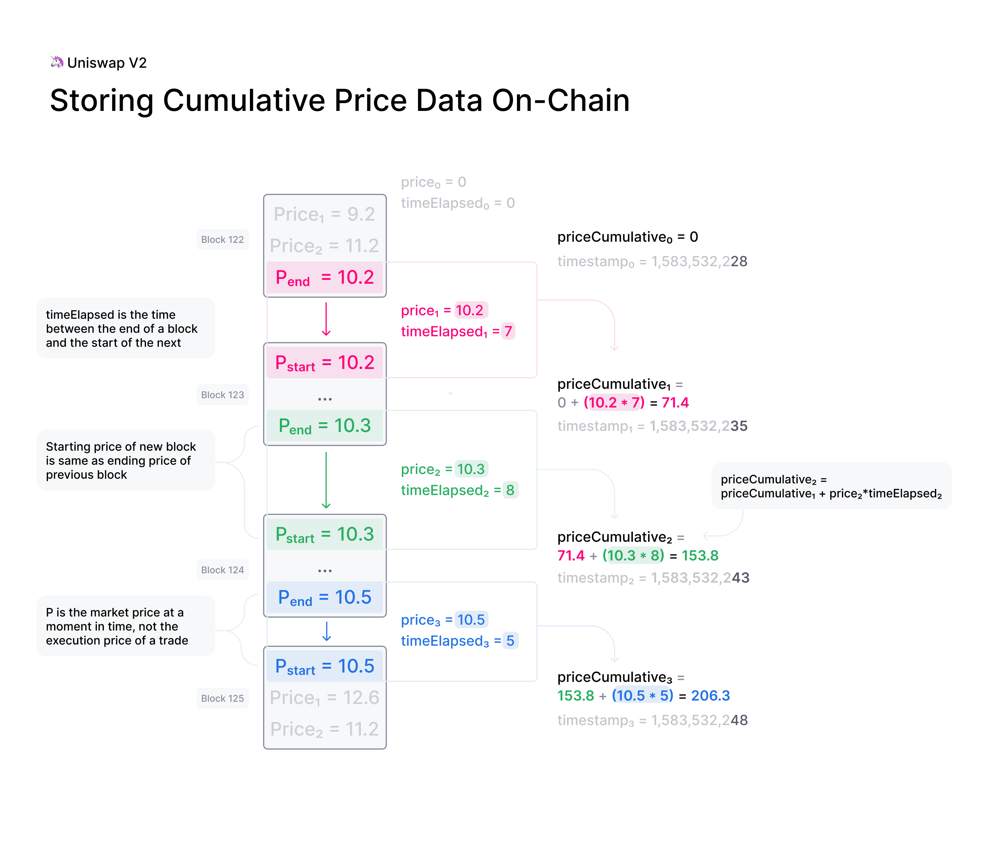

# Introduction

Uniswap V2 enables building highly decentralized and manipulation-resistant on-chain price oracles.

Price oracles are a crucial to the viability and security of DeFi protocols. Oracle designs between different projects have been implemented on an ad hoc basis, with varying degrees of decentralization and security. Because of this, the ecosystem has witnessed numerous high-profile hacks where the oracle implementation is the main attack vector.

Some of these vulnerabilities have been discussed [here](https://samczsun.com/taking-undercollateralized-loans-for-fun-and-for-profit/). A lack of a robust price oracle has held back both the adoption of DeFi and made it difficult and costly for new entrants to launch new derivative products.

Enter Uniswap V2. As liquidity and trade volume on the protocol continue to grow, Uniswap's on-chain trade history is becoming an evermore valuable, accurate, and robust source of price information. This insight has been formalized into the Price Oracle mechanism in Uniswap V2.

# Why Oracles?

On-chain price feeds are a critical component for many decentralized financial applications including those similar to derivatives, lending, margin trading, prediction markets and more.

Despite closely tracking the real-world price most of the time, Uniswap V1 cannot be used safely as a price oracle. In Uniswap V1, an attacker can simply manipulate the price just before it is measured.

# Uniswap V2 solution

Uniswap V2 includes a number of improvements for price feeds built on top of it. First, every pair measures (but does not store) the market price at the beginning of each block, before any trades take place. This price is expensive to manipulate because it was set by the last transaction in a previous block.

**To set the measured price to one that is out of sync with the global market price, an attacker has to make a bad trade at the end of a previous block** , typically with no guarantee that they will be able to arbitrage it back in the next block. Attackers will lose money to arbitrageurs, unless they can "selfishly" mine two blocks in a row. This type of attack presents a number of challenges and [has not been observed to date](https://arxiv.org/abs/1912.01798).

This alone is not enough. If significant value settles based on the price resulting from this mechanism, then the profit of an attack likely can outweigh the loss.

Instead, Uniswap V2 adds this end-of-block price to a single cumulative-price variable in the core contract weighted by the amount of time this price existed. **This variable represents a sum of the Uniswap price for every second in the entire history of the contract.**

This variable can be used by external contracts to track accurate time-weighted average prices (TWAPs) across any time interval.

This is done by reading the cumulative price from an ERC20 token pair at the beginning and at the end of the interval. The difference in this cumulative price can then be divided by the length of the interval to create a TWAP for that period.

TWAPs can be used directly or as the basis for moving averages (EMAs and SMAs) as needed.

A few notes:

- For a 10-minute TWAP, sample once every 10 minutes. For a 1-week TWAP, sample once every week.
- For a simple TWAP, the cost of manipulation increases (approx. linear) with liquidity on Uniswap, as well as (approx. linear) with the length of time over which you average.
- Cost of an attack is relatively simple to estimate. Moving the price 5% on a 1-hour TWAP is approximately equal to the amount lost to arbitrage and fees for moving the price 5% every block for 1 hour.

There are some nuances that are good to be aware of when using Uniswap V2 as an oracle, especially where manipulation resistance is concerned. The <a href='/whitepaper.pdf' target='_blank' rel='noopener noreferrer'>whitepaper</a> elaborates on some of them. Additional oracle-focused developer guides and documentation will be released soon.

In the meantime, check out our [example implementation](https://github.com/Uniswap/uniswap-v2-periphery/blob/master/contracts/examples/ExampleOracleSimple.sol) of a 24 hr TWAP Oracle built on Uniswap V2!

In summary, Uniswap V2 introduces a 2 new variables in each pair, `price0CumulativeLast` and `price1CumulativeLast`, that store the prices of `token0` and `token1` respectively, multiplied by for how long they were observed (in seconds). These variables are cumulative, meaning they are ever-increasing. They are updated with the first `swap`/`mint`/`burn` of each block.

You can use these either of these new variables to compute an average price between 2 observations. To do so, take the difference (i.e. subtraction) of two observations, and divide by the time elapsed between them. This is the basis of building oracles on top of V2.

## Manipulation resistance

The cost of manipulating the price for a specific time period can be roughly estimated as the amount lost to arbitrage and fees every block for the entire period. For larger liquidity pools and over longer time periods, this attack is impractical, as the cost of manipulation typically exceeds the value at stake.

Other factors such as network congestion can reduce the cost of attack. For a more in-depth review of the security of Uniswap V2 price oracles, read the [security audit section on Oracle Integrity](https://uniswap.org/audit.html#org87c8b91).

## Using Uniswap V2 price oracles

Importantly, Uniswap V2 is not opinionated on how you use the new cumulative price variables, allowing you to build oracles that compute different kinds of price averages and over different periods.

### Building an oracle

To learn more about building oracles check out <Link to="/docs/v2/SDK">building an oracle</Link> in the developer guides.
